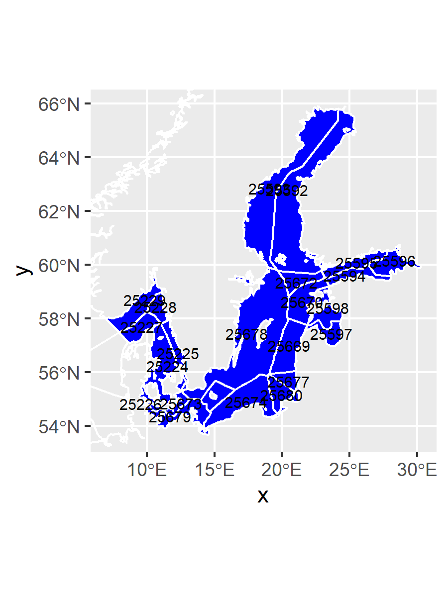

# EMODnet Biology Phytoplankton of the greater Baltic Sea

## Introduction

The project aims to produce comprehensive data product of the occurence and absence of (phyto)plankton species. As a basis, data from EMODnet Biology are used. The selection of relevant datasets is optimized in order to find all planktonic species, and exclude all species that are not planktonic. The occurences from EMODnet Biology were complemenented with absence data assuming fixed species lists within each dataset and year. The products are presented as maps of the distribution of the 20 most common species of (phyto)plankton in the Greater Baltic Sea.

## Geographical coverage

The aim is to cover the Greater Baltic Sea including the Kattegat and Skagerak seas. Subareas from the eez-iho layer in marineregions.org were selected as in the map below.



## Temporal coverage

The timespan used was "1995-01-01" until "2020-05-31"

## Directory structure

```
{{directory_name}}/
├── analysis
├── data/
│   ├── derived_data/
│   └── raw_data/
├── docs/
├── product/
└── scripts/
```

* **analysis** - Markdown or Jupyter notebooks
* **data** - Raw and derived data
* **docs** - Rendered reports
* **product** - Output product files
* **scripts** - Reusable code

## Data

Raw data were downloaded from EMODnet Biology using WFS requests. This was done in two steps.

Per subregion, all observations of species with the trait "phytoplankton" or "Phytoplankton" were extracted.

Because of uncertainties in extracting all phytoplankton species (due to absence of traits for example) all data was extracted for these datasets. Within these datasets phyla were selected that contain phytoplankton species, after which a manual selection was performed to filter out non-phytoplankton species also belonging to these phyla (e.g. macroalgae).

The datasets included were:

| Dataset | EMODnet Biology link |
| ---------------------------- | ------------------------------------------------------------------ |
| "785 Continuous Plankton Recorder (Phytoplankton)" | https://www.emodnet-biology.eu/data-catalog?module=dataset&dasid=785 |
| "2453 SHARK - Marine phytoplankton monitoring in Sweden since 1983" | https://www.emodnet-biology.eu/data-catalog?module=dataset&dasid=2453 |
| "2722 PANGAEA - Data from various sources" | https://www.emodnet-biology.eu/data-catalog?module=dataset&dasid=2722 |
| "4424 ICES Phytoplankton Community dataset" | https://www.emodnet-biology.eu/data-catalog?module=dataset&dasid=4424 |
| "5664 Phytoplankton data for Danish marine monitoring (ODAM) from 1988 - 2016" | https://www.emodnet-biology.eu/data-catalog?module=dataset&dasid=5664 |
| "2463 Polish Monitoring Programme - Monitoring of the Baltic Sea: phytoplankton" | https://www.emodnet-biology.eu/data-catalog?module=dataset&dasid=2463 |
| "5724 Finnish Baltic Sea phytoplankton monitoring, KPLANK database" | https://www.emodnet-biology.eu/data-catalog?module=dataset&dasid=5724 |
| "5727 SHARK - Regional monitoring and monitoring projects of Epibenthos in Sweden since 1994" | https://www.emodnet-biology.eu/data-catalog?module=dataset&dasid=5727 |
| "2455 SHARK - National Epibenthos monitoring in Sweden since 1992" | https://www.emodnet-biology.eu/data-catalog?module=dataset&dasid=2455 |
| "1985 NODC World Ocean Database 2001: Plankton Data" | https://www.emodnet-biology.eu/data-catalog?module=dataset&dasid=1985 |
| "5840 IFCB110-SMHI: Imaging flow cytometry from SMHI in Tangesund 2016" | https://www.emodnet-biology.eu/data-catalog?module=dataset&dasid=5840 |
| "6021 Phytoplankton composition, biomass and abundance in Estonian territorial waters 1993-2016" | https://www.emodnet-biology.eu/data-catalog?module=dataset&dasid=6021 |

### This preprocessing resulted in a aggregated dataset corresponding to 2021 unique species in 16444 unique locations (lat and long).

```
{{data_wfs_request}}
```

## Analysis

...

## Citation

Please cite this product as:
*{{citation}}*
